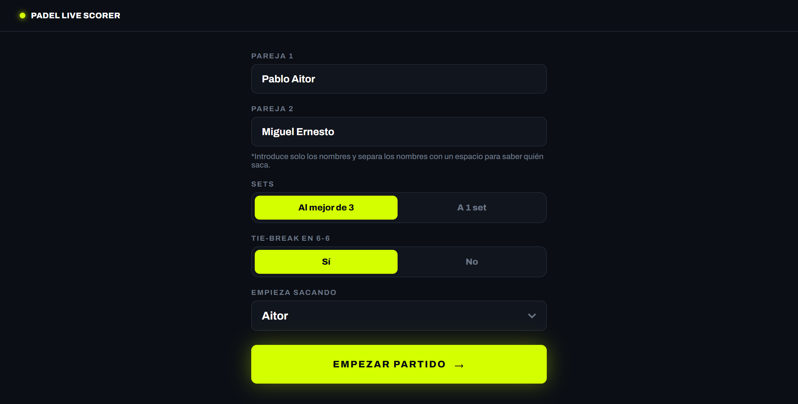
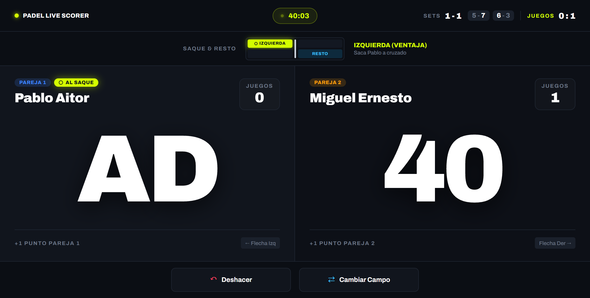

<div align="center">

# 🎾 Padel Live Scorer

**Marcador de pádel online, gratis y pensado para usarse en la pista.**
Lleva los puntos, juegos y sets, y sabes siempre quién saca y desde qué lado.
[](https://stackblitz.com/github/Ibai990/padel-live-scorer)
<br>
[](https://angular.dev)
[](https://www.typescriptlang.org)
[](https://pages.cloudflare.com)

</div>

---

## Características

- **Puntuación completa de pádel:** 15, 30, 40, iguales y ventaja, juegos, sets y tie-break.
- **Quién saca y desde dónde:** indica la pareja y el jugador al saque, y si saca desde la derecha (iguales) o la izquierda (ventaja).
- **Mini pista de saque y resto:** muestra de un vistazo la diagonal del saque.
- **Historial de sets:** los resultados de los sets anteriores siempre visibles (6-2, 4-6…).
- **Deshacer ilimitado:** corrige cualquier punto marcado por error, incluso si cerró un juego o un set.
- **Cambio de campo:** intercambia los lados en pantalla cuando cambiáis de campo.
- **No pierde el partido:** se guarda automáticamente en el navegador, aunque recargues o se cierre la pestaña.
- **Diseñado para el móvil:** funciona en vertical y horizontal, con zonas táctiles grandes.
- **Control por teclado:** `←` y `→` para sumar puntos, `Retroceso` para deshacer.

## Capturas

<div align="center">
  
  &nbsp;
  
</div>

## Cómo se usa

1. Entra en **[padellivescorer.com](https://padellivescorer.com)**.
2. Escribe el nombre de las dos parejas (por ejemplo, `Aitor Pablo || Miguel Ernesto`).
3. Toca el lado de la pareja que gana cada punto.

No hace falta registrarse ni instalar nada.

## Tecnologías

- **Angular** con componentes standalone y **signals** para el estado reactivo.
- **Prerenderizado** de la portada para SEO y carga rápida.
- **localStorage** para persistir el partido en el dispositivo.
- Desplegado en **Cloudflare Pages** con despliegue continuo desde GitHub.

## Ejecutar en local

Requisitos: [Node.js](https://nodejs.org) (versión indicada en el archivo `.nvmrc`) y Angular CLI.

```bash
git clone https://github.com/Ibai990/padel-live-scorer.git
cd padel-live-scorer
npm install
ng serve
```

Abre `http://localhost:4200` en el navegador.

Para generar la versión de producción:

```bash
npm run build
```

## 📂 Estructura

```
src/app/
├── core/          # Estado del partido y reglas del pádel (MatchService)
├── features/
│   ├── setup/     # Pantalla de inicio
│   └── marcador/# Marcador, paneles de pareja y mini pista
└── shared/        # Componentes reutilizables
```

## 📄 Licencia

Este proyecto está bajo la licencia [MIT](LICENSE).
